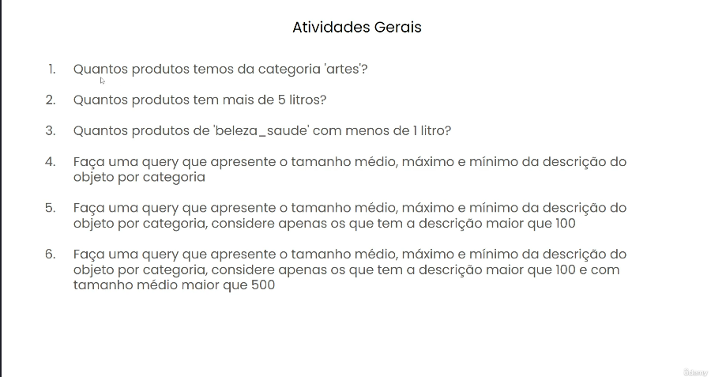

# Atividades_Gerais_SQL

Esse repositório é destinado a responder algumas perguntas de negócio usando a Linguagem SQL.

Essas atividades tem uma abordagem mais básica, buscando praticar e fixar esses conceitos.

# Base de Dados
Utilizei a Base de Dados da empresa Olist.

O arquivo da base de dados está disponível no Google Drive. [Base de Dados Olist](https://drive.google.com/file/d/1R_JJUxY89uMzwxapclUQzD4ZfEB474Dg/view?usp=drive_link).

Abaixo temos o Modelo Lógico do Banco de Dados.

# Tecnologias e Ferramentas
        

# Perguntas

# Acesso à Resolução
Você pode acessar à resolução do projeto clicando [aqui](Resolução).

